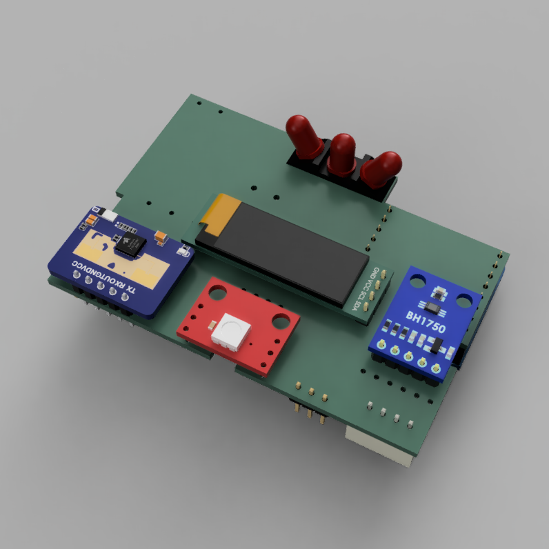

# Wemos Multiplate
(placeholder name)

Multifunctional device with esphome compatible sensors and interactive tools to improve your smart home experience.



## Features

- OLED display (128x32 or 128x64 are supported)
- LD2410C 24Ghz presence sensor
- 2 addressable RGB LEDs
- beeper
- SHT31 temperature/humidity sensor
- 3 IR emitter LEDs
- BH1750 ambient light sensor (optional)
- APDS9960 gesture sensor (optional)
- pin headers for external 5v relay module (optional)
- extra pin headers for further expandability
- fits in a 503 wall receptacle
- 3D printable cover

## Esphome compiling and flashing
- install esphome on your machine. https://esphome.io/guides/installing_esphome.html
- duplicate the `secrets_sample.yaml` file, rename it to `secrets.yaml`, and fill your wifi SSID data in.
- duplicate `esphome/multiplate.yml` file, rename it to your liking.
- open the duplicated file and edit `device_name` to your liking, and comment/uncomment the modules you want to use.
- connect the Wemos D1 mini via USB and flash it using the `esphome run` command.
- disconnect the Wemos D1 mini, insert it into the multiplate, and enjoy.

## Home Assistant device page preview


## Customizing modules

### mmWave presence sensor

The sensor internally has 8 'gates', each one representing a distance area from the sensor. The sensitivity of each gate can be tuned using an android app.
- Download https://play.google.com/store/apps/details?id=com.hlk.hlkradartool&hl=en&gl=US&pli=1
- Enable bluetooth on the sensor (you can do this from the Home Assistant device page)
- Open the app and connect to the sensor
- Enable Engineering Mode and tune the gates. The lower the value, the higher the accuracy (less energy required to trigger the gate)
- Refer to this page for more info. https://wiki.apolloautomation.com/books/msr-1/page/how-to-tune-mmwave-using-home-assistant

Note: it is possible to expose all the sensitivity tuning controls via ESPhome to Home Asisstant, but we are not doing that. This reduces computational load on the Wemos D1 mini.

### Gesture sensor

TODO

### OLED Display

You can use either 128x32 or 128x64 OLED modules. Just uncomment the corresponding `display` line in your main yml file.

### IR blaster

If you want to use the IR leds as a remote, please add any entity you want to use the IR transmitter with, to the main yml file. Example:

```
climate:
  - platform: daikin
    name: ${device_name}-climate
```
